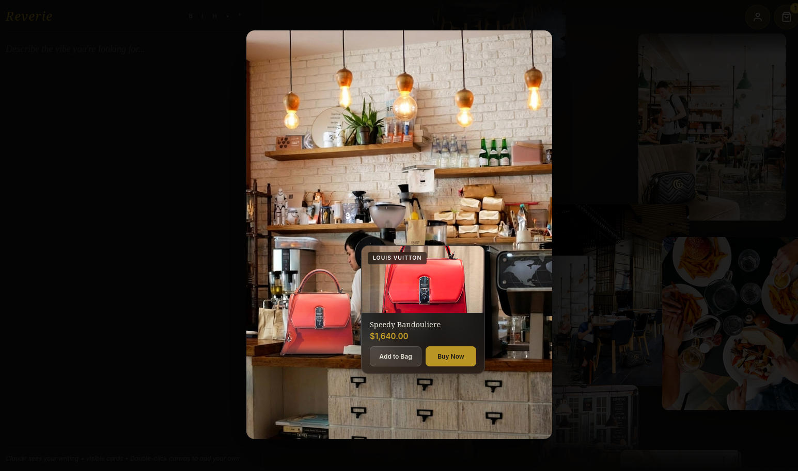

<picture>
  <source media="(prefers-color-scheme: dark)" srcset="./static/darkmode.png">
  <source media="(prefers-color-scheme: light)" srcset="./static/lightmode.png">
  
</picture>

## Reverie (Studio Tenwu) 

### Team Name
Studio Tenwu

### Team Members
- Warren Zhu
- Matt Kotzbauer

### Demo
- **Live URL's:**
    - Advertiser Console: https://ecomm-hacks-starter.vercel.app/console
    - Consumer Network: https://ecomm-hacks-starter.vercel.app/consumer
- **Demo Video:** N/A

### What We Built

**Reverie** is an advertising platform that integrates shoppable products into Pinterest-style lifestyle imagery. Instead of interrupting the user's social media experience with separate ad placements, Reverie uses AI to naturally place products into scenes the user is already drawn to, allowing organic product discovery through hover-to-reveal interactions.

### How It Works

1. **AI-Powered Product Placement**: Using Nano Banana Pro, we composite products into curated lifestyle scenes. Nano Banana blends the product into the environment with proper lighting, shadows, and perspective.

2. **Mask-Based Hover Detection**: Nano Banana also generates a segmentation mask that identifies exactly where the product is in the scene. We use red-channel extraction to create a clean binary mask (white for product, black for background).

3. **Natural Product Discovery**: When users hover over a product area (detected with canvas pixel sampling of the mask), a subtle highlight appears and a translucent product card slides in. Users can add the product to their bag or do a 1-click purchase.

4. **Non-Intrusive UX**: The focus of the UX is that ads don't interrupt the consumer experience, instead being placed in locations that match their aesthetic preferences and incite curiosity.

### Key Features

- **Product insertion** - Organic insertions of products into images
- **Gallery scrolling** - Pinterest-style scroll with staggered card layouts
- **Mask-based hover detection** - Detects when user hovers or clicks on the product, showing translucent popup with the purchasing options
- **Writing pane** - Users can describe their mood/vibe to interact with and personalize the feed
- **'Add to Bag' animation** - When added to the user's bag, the product physically fades out from the scene

### Tech Stack

- **Frontend:** React 18 + TypeScript + Vite + TipTap (rich text editor)
- **Backend:** FastAPI + Python + uvicorn
- **Models:** Nano Banana Pro for scene generation and mask creation, Gemini 3 Pro for text
- **Styling:** CSS, Playfair Display + Crimson Pro + DM Sans typography
- **Image Processing:** Pillow for mask post-processing (red-channel extraction)

### Setup Instructions

```bash
# Clone the repo
git clone https://github.com/WarrenZhu050413/ecomm-hacks-starter.git
cd ecomm-hacks-starter

# Frontend setup
npm install
npm run dev

# Backend setup (in separate terminal)
cd backend
cp .env.example .env
# Add your GEMINI_API_KEY to .env
uv sync
uv run uvicorn app.main:app --reload

# Generate test images (optional)
cd backend
uv run python test_product_integration.py
```

### Screenshots

Advertisers can input demographics, preferred scenes, and a semantic description of scenes they want their product to appear in. 


Advertisers can then simulate the consumer shopping experience within the console, allowing them to fine-tune parameters.


Consumers can browse posts that they are interested in, as well as write personal thoughts and things they want to see on the left third of the screen.


The consumer can hover or click on an item of interest to see its listing, and can either add it to their bag or buy it in one click.

### Challenges We Faced

- **Visual interfaces within 24 hours**: Attention to detail within user interactions and aesthetics of pages were a definite priority
- **Debugging coordinate mapping / race conditions**: CSS `object-fit: cover` crops images differently than the masks, requiring hover detection to consider offset.

### What's Next

- **Social network layer**: Building out a Pinterest-like platform where users can create and share mood boards, with every image potentially shoppable. This would also allow the effectiveness of the platform to compound with network effects.
